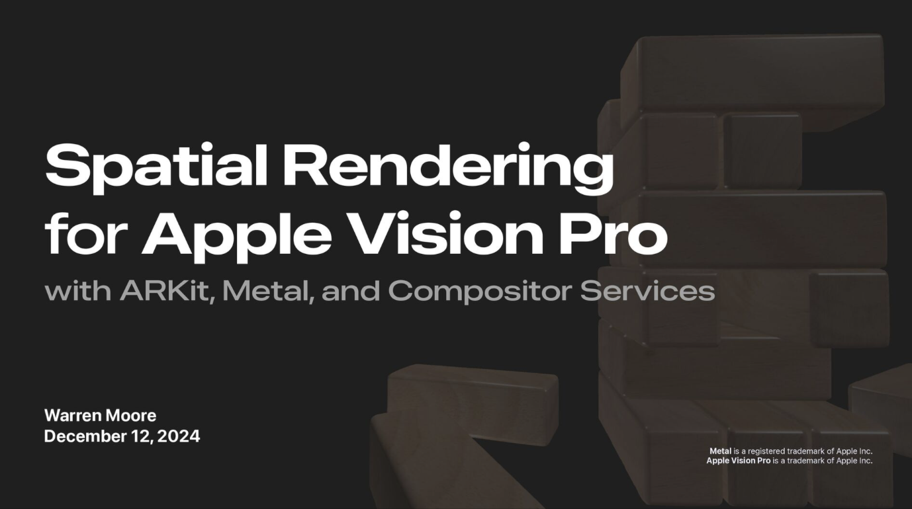

# Spatial Rendering for Apple Vision Pro

**Important**: This repository uses git submodules. Use `--recursive` when cloning. e.g.:

```
$ git clone --recursive --depth 1 git@github.com:metal-by-example/spatial-rendering.git
```

## Talk

A recording of the talk for which this sample was created is available on [YouTube](https://youtu.be/vO0M4c9mb2E).

See also the slides that accompanied this talk:

[](https://speakerdeck.com/warrenm/spatial-rendering-for-apple-vision-pro)

## Overview

Modern RealityKit is a powerful framework for building spatial experiences, but sometimes you need to use lower level facilities like ARKit, Metal, and Compositor Services.

This sample is a medium-scale example of how to use various features from ARKit and Metal to perform spatial rendering in a passthrough style. It allows the user to scan their environment for flat surfaces and place a wooden block tower, then interact with it with their hands.

## Usage

It is recommended to run this app on Vision Pro hardware rather than the simulator. Although it will run on the simulator, it has no interactive features in this context because of its reliance on hand tracking.

To build and run the app, you will need to ensure that the dependency on the Jolt physics engine is fulfilled (ideally by cloning recursively, or by a subsequent `git submodule init & git submodule update`)—just downloading the code from GitHub is **not** sufficient.

You will also need to set your team identifier in the project in order for code-signing to work.


